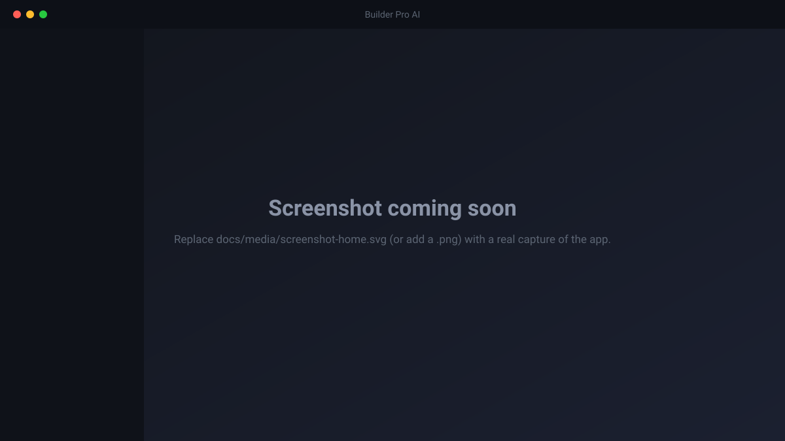

# Builder Pro AI

[](https://github.com/ssheleg/builder-pro-ai/actions/workflows/ci.yml)
[](CHANGELOG.md)
[](docs/build-macos.md)
[](LICENSE)
[](https://tauri.app)

**A macOS control panel that takes an idea to a working project and keeps the whole vibecoding
process organized — so you steer, and agents do the rest.**

Builder Pro AI runs off-the-shelf AI coding agents (claude-code, hermes, opencode, kilo, …) in
real terminals, wraps them in a workspace of repos, a live file explorer, a cross-project
knowledge graph, an idea→research→insight→task pipeline, and (on the roadmap) an app-native agent
org that decides *what* to build. The enemy it exists to kill is the **attention tax**: with 5–6
projects in flight, opening the app should answer *where is each one, what moved, and what needs
me* — in under 30 seconds, without you becoming a poller and button-presser.

Built with **Tauri 2** (Rust core + React 19 / TypeScript UI). Ships as a universal macOS binary.

<p align="center">
  
  <br>
  <em>Placeholder — a real screenshot lands here before the first public release.</em>
</p>

> **Status: `0.10.0`, pre-1.0, macOS-only, source-available under a noncommercial license.** Everything
> below the "Shipped" line is implemented, tested, and documented; everything under "Planned" is
> not built yet and is labelled as such. **Signed + notarized universal binaries are published on
> [Releases](https://github.com/ssheleg/builder-pro-ai/releases)** (or build from source — see
> [Getting started](#getting-started)). The UI is **English**, **light + dark** (system-default with
> a manual toggle).

---

## Table of contents

- [Why](#why)
- [Highlights](#highlights)
- [Getting started](#getting-started)
- [Running the tests](#running-the-tests)
- [Architecture](#architecture)
- [Roadmap](#roadmap)
- [Contributing](#contributing)
- [Maintaining this README](#maintaining-this-readme)
- [License](#license)
- [Documentation index](#documentation-index)

---

## Why

Running several projects through AI coding agents at once is a context problem, not a typing
problem. Goals drift, each project sits at a different stage, and you degrade into polling
terminals and pressing buttons. Builder Pro AI's north stars:

1. **Time-to-context on app open** — full picture of every project in **< 30 s**.
2. **Owner interventions per shipped task → 1** — the one approval that actually matters.
3. **Unattended progress** — hours of agent work without stalling on a button.

Design tenets the whole codebase is held to:

- **Production-grade, no MVP half-states.** Every slice ships finished — TDD tests, error handling
  + honest degradation, structured logging, and docs are part of Definition of Done.
- **Max autonomy, min human-in-the-loop.** Humans set goals and quality; agents self-decide
  wherever they safely can.
- **Honest about state.** The app never fakes session or agent status, and never claims durability
  it doesn't have.
- **Additive, constructor-style growth.** The system grows cube-by-cube; schema and architecture
  extend by addition, never rebuild.

## Highlights

What works today (`0.10.0`):

- 🖥️ **Daemon-owned terminals** — real PTYs supervised by `launchd`, so live shells survive the GUI
  closing, crashing, or restarting (tmux-style reattach + sanitized scrollback replay). OSC-133/OSC-7
  shell integration drives status; a command strip shows recent commands with pass/fail.
- 🗂️ **Multi-root workspaces + file explorer** — a workspace is an ordered list of equal repo roots;
  a gitignore-aware lazy file tree with read-only preview and debounced live FSEvents watch, all
  path-validated against the active roots.
- 🎯 **App-domain store** (`bpa-orchd`, a second daemon) — Projects, Goals (full tree), Ideas,
  Insights, Tasks/Subtasks, and RuleSets, with full CRUD, invariants, cascades, and per-project /
  whole-store JSON export–import that round-trips field-for-field.
- 🕸️ **Cross-project knowledge graph** — typed nodes and edges, soft-references onto domain rows,
  edges that link *different* projects and survive both projects' restarts, an editable
  `@xyflow/react` canvas, and a workspace-wide retrieval API (the contract the future agent org
  consumes).
- 🔌 **Extensions (MCP + connectors + skills)** — an MCP client speaking Streamable HTTP and stdio,
  OAuth 2.1 (PKCE) / api-key connector accounts with tokens in the macOS Keychain, a SKILL.md
  registry, and a trust layer (consent, per-tool allowlist, spend/rate caps, untrusted-tagging,
  append-only audit) gating every outbound call.
- 💡 **Idea → research → insight → task pipeline** — quick-capture (⌘K), run research through a
  connected MCP tool with a spend preflight, review the durable artifact, form an owner-evaluated
  insight against goals + graph context, and drop a task into the backlog — end-to-end, without an
  agent org.
- 🧭 **Attention-first Home** — sessions waiting for input pinned first with one-click jump, then
  running, then recently exited, across every workspace, with no polling.
- 🎨 **Calm, metrics-forward UI, light + dark** — a design-token system (one accent, tabular-nums
  numbers, WCAG-AA contrast verified by a test) with a system-default theme and a manual toggle; a
  small primitives kit (Panel/Stat/Badge/Button/Dialog) every view is built from.
- 🛡️ **Reliability + honesty baked in** — timeout-bounded external calls (no single hung endpoint
  wedges the daemon), honest storage-degradation banners, double-submit guards on every mutation, a
  toast queue, reconnect that rehydrates every view, per-verb structured tracing, and a **diagnostics
  log** (secret-scrubbed, copyable support bundle) plus an error boundary, so a failure's cause is
  reconstructable instead of a vanished toast or a white screen.

The full feature log (every slice, contract, and scope line) lives in
[`docs/architecture.md`](docs/architecture.md) and the [Roadmap](#roadmap) below; the
contract → test matrix is [`docs/traceability.md`](docs/traceability.md).

## Getting started

**Prerequisites**

- **macOS** (Apple Silicon or Intel) — this is a macOS-only app (PTYs, `launchd`, Keychain,
  FSEvents).
- **Rust** (stable; the repo pins a toolchain via `rust-toolchain.toml`) — <https://rustup.rs>
- **Node.js 24+** and npm (enforced via `package.json` `engines`).
- Xcode Command Line Tools (`xcode-select --install`).

**Run it in dev mode**

```sh
# 1. Clone + install JS deps
git clone https://github.com/ssheleg/builder-pro-ai.git
cd builder-pro-ai
npm install

# 2. Make sure cargo is on PATH, add the macOS targets
export PATH="$HOME/.cargo/bin:$PATH"
rustup target add aarch64-apple-darwin x86_64-apple-darwin

# 3. Build BOTH background daemons (the app talks to them over a Unix socket)
cargo build -p bpa-sessiond -p bpa-orchd

# 4. Stage the daemon binaries where Tauri's build expects them
#    (both are declared as externalBin sidecars, so build.rs needs both, even in dev)
mkdir -p src-tauri/binaries
TRIPLE="$(rustc -vV | sed -n 's/host: //p')"
cp target/debug/bpa-sessiond "src-tauri/binaries/bpa-sessiond-$TRIPLE"
cp target/debug/bpa-orchd    "src-tauri/binaries/bpa-orchd-$TRIPLE"

# 5. Launch the app (Vite dev server + Tauri window)
npm run tauri dev
```

On first launch the app installs and supervises the two daemons via per-user `launchd`
LaunchAgents; they keep your terminals and app data alive across GUI restarts. Ops details:
[`docs/runbook-daemon.md`](docs/runbook-daemon.md) (terminals) and
[`docs/runbook-orchd.md`](docs/runbook-orchd.md) (app domain).

**Build a release `.app`**

```sh
# Universal (arm64 + x86_64), signed + notarized when Apple credentials are present;
# degrades honestly to a dev-signed build (and says so) when they aren't.
bash scripts/build-universal.sh
```

Full release runbook — credentials, signing, notarization, clean-VM smoke test:
[`docs/build-macos.md`](docs/build-macos.md).

**Prefer a prebuilt binary?** There's a **manual, owner-triggered** release workflow
(`.github/workflows/release.yml`) — it never runs on its own. When the owner runs it (Actions →
*release* → *Run workflow*), a universal `.app`/`.dmg` is built and attached to a **draft**
[GitHub Release](https://github.com/ssheleg/builder-pro-ai/releases); once published it's
downloadable there. See [`docs/build-macos.md`](docs/build-macos.md#manual-release-workflow-github-actions-owner-triggered).

## Running the tests

One command runs the whole gate (the same 11 stages CI runs):

```sh
bash scripts/final-suite.sh   # → "ALL GATES PASSED"
```

| Suite | Command | Covers |
|---|---|---|
| Rust workspace | `cargo test --workspace` | both daemons + shared crates + Tauri core — **1260 tests** (`[Unreleased]`; `0.10.0` had 1170) |
| TypeScript | `npx vitest run` | store, IPC, hooks, design tokens/contrast, diagnostics, and every UI component — **1270 tests, 71 files** (`[Unreleased]`; `0.10.0` had 1130/63) |
| e2e (terminals) | `npm run e2e:survive` | create → run → status → quit client → daemon+shell survive → reattach + scrollback |
| e2e (app domain) | `npm run e2e:orchd` | create → drain-restart → data intact → export → wipe → re-import → graph/MCP/research survival |
| Coverage gate | `bash scripts/coverage-gate.sh` | ≥80% line coverage on both daemon crates (needs `cargo install cargo-llvm-cov`) |
| English-only gate | `bash scripts/check-english.sh` | fails on any Cyrillic outside the frozen-record allowlist |

Every locked spec contract maps to a concrete test in [`docs/traceability.md`](docs/traceability.md).

## Architecture

Three OS processes, two independent daemons:

```
┌──────────────── Builder Pro AI.app ────────────────┐
│  React webview (UI)          Rust core (broker)     │
│  • terminal panes            • #[tauri::command]s    │
│  • workspace / files rail    • file explorer + watch │
│  • project / graph panels    • Unix-socket clients   │
└───────────────┬───────────────────┬─────────────────┘
                │ Hop B (CBOR)       │ Hop B (CBOR)
      ┌─────────▼────────┐  ┌────────▼─────────────────┐
      │  bpa-sessiond    │  │  bpa-orchd               │
      │  terminal domain │  │  app domain: projects,   │
      │  • PTY supervisor│  │  goals, ideas, insights, │
      │  • OSC parser    │  │  tasks, rules, knowledge │
      │  • SQLite (WAL)  │  │  graph, MCP client,      │
      └──────────────────┘  │  connectors, research    │
   launchd-supervised       │  • SQLite (orchd.db)     │
                            └──────────────────────────┘
              both launchd-supervised sidecars
```

- **`bpa-sessiond`** owns every PTY and durable terminal state, so the GUI can die without killing
  a running shell.
- **`bpa-orchd`** owns the app domain (projects/goals/ideas/insights/tasks/rules), the knowledge
  graph, the MCP client + connectors + skills, and the research pipeline — the app's only outbound
  network egress and Keychain surface.
- The **Tauri core** is a thin broker: `#[tauri::command]` surface, the file explorer + live watch
  (GUI-lifetime, never over the socket), and a Unix-socket client to each daemon.

Full detail — the two-daemon topology, the wire protocol, the survival table, the three-rail UI —
is in [`docs/architecture.md`](docs/architecture.md).

## Roadmap

Builder Pro AI grows one self-contained slice at a time; each ships production-grade before the
next starts. Versions are the git tags in [`CHANGELOG.md`](CHANGELOG.md).

### Shipped

| Version | Slice | What landed |
|---|---|---|
| `0.2.0` | Protocol v2 | CBOR wire, `[min,max]` version negotiation, multi-subscriber attach, drain-on-upgrade, cold-rehydrate |
| `0.3.0` | Workspace + files (S2) | multi-root workspaces, file explorer + read-only preview + live watch, attention-first Home, command strip, terminal file links |
| `0.4.0` | App-domain store (S3) | the `bpa-orchd` daemon + Projects/Goals/Ideas/Insights/Tasks/RuleSets, CRUD + export/import, ⌘K capture |
| `0.5.0` | Knowledge graph (S4) | typed cross-project graph, workspace-wide retrieval API, editable `@xyflow/react` canvas |
| `0.6.0` | Extensions (S-EXT) | MCP client (HTTP + stdio), OAuth/api-key connectors, skills registry, trust layer, Keychain |
| `0.7.0` | Research pipeline (S-IDEA) | `research_run` + async run driver + boot-reconcile, idea→research→insight→task UI |
| `0.8.0` | Reliability + English + Tier-2 (S-POLISH) | timeouts, storage-degradation honesty, per-verb tracing, full English-only sweep + CI gate, project un-archive, `metric_refs` editor, editable graph, OAuth registry |
| `0.9.0` | UX-scenario base + redesign (S-UXR) | a maintained 181-scenario UX catalog + code-traced audit; a design-token system and primitives kit; every view restyled metrics-forward in **light + dark** |
| `0.9.1` | Diagnostics + contrast (S-DIAG / S-DESIGN) | a secret-scrubbed error log + error boundary + copyable support bundle; a measured WCAG-AA contrast pass with a regression test |
| `0.9.2` | Boot-race fix (BL-101) | `AppState` managed synchronously in `setup()` so a first-frame command returns an honest `Disconnected`, never the raw Tauri "state not managed" error — caught by the new diagnostics log on a live install |
| `0.10.0` | Soft Control Room v2 + the autonomy/analytics slice + UX audit remediation | a warm fill-model visual base (36 views migrated, `SegmentedPill`/`Heatmap` atoms); keep-awake, task priority, a file-backed Docs tab, CEO delegation **config** (S6b honesty boundary — it persists scope, it does not act), and a usage/output Stats dashboard; then a deep audit of SCN-045..057 whose every finding was fixed — first-run terminals now open in the picked folder (they were landing in `$HOME`), stats gained a request-epoch guard, a cancellable scan and a per-model-family cut, and every failed/loading source shows "—" instead of a zero that looks like data |

### Planned (not built yet)

The next arc is the **agent org** — the meta-agents that decide *what* to build and drive the
terminals — plus the surfaces that feed and observe them. In dependency order:

- **S5 — Kanban view** over the Task entity (drag-persist, live agent-driven moves).
- **S6a — LLM provider layer** — provider trait, OpenRouter/OpenAI/GLM adapters, tool-calling,
  routing/fallback/streaming, per-call cost capture. (Unblocks owner-evaluated → LLM-evaluated
  insight fit-scoring.)
- **SW1 — Workflow engine** (workflow-as-data): versioned definitions, typed steps, run-observability.
- **S6b — Agent runtime** — the CEO→PM→engineer loop as the default workflow; PM gap-analysis on a
  real repo; runs survive GUI + daemon restarts.
- **S6c — Approval inbox** — one generic gate for escalations, human-approval steps, and policy
  gates, batched across all projects.
- **SW2 / SW3 — Scheduler + triggers, and a visual workflow editor.**
- **S6d / S6e — External worker adapters** (per-CLI stuck detection) and **custom-agent authoring**.
- **S7 — Stats/observability**, **S8 — Metrics ingestion → sprint planning**,
  **S9a/S9b — Telemetry ingestion + deploy/verify** (the self-heal loop).
- **SH — Mission-control home** (capstone): six lanes per project, live agent feed, "what moved"
  deltas, hot-questions inbox.

Near-term polish tracked in [`docs/backlog.md`](docs/backlog.md) (e.g. a real PTY trailing-output
drain fix behind the `BL-40` test flake, LLM fit-scoring, token-streaming research, semantic graph
retrieval). The canonical, always-current roadmap with dependencies is
[`docs/superpowers/specs/2026-07-01-builderpro-platform-overview.md`](docs/superpowers/specs/2026-07-01-builderpro-platform-overview.md).

## Contributing

Contributions are welcome. Before opening a PR:

1. Read [`CONTRIBUTING.md`](CONTRIBUTING.md) for the process rules (branching, commit style,
   Definition of Done).
2. Run `bash scripts/final-suite.sh` locally — it must print `ALL GATES PASSED` (the same gate CI
   enforces).
3. Keep to the tenets: production-grade only (tests + error handling + docs in the same change),
   **English** everywhere (the CI no-Cyrillic gate enforces it), and honesty about scope (label
   anything not finished, never claim it as done).

Bug reports and feature ideas go in GitHub Issues; larger designs start from a short spec in
`docs/superpowers/specs/` before code.

## Maintaining this README

This README is the project's front door — treat it as a maintained artifact, not a one-time write.
Rules for keeping it correct:

1. **Truth over polish.** Every claim must be real *right now*. If something isn't built, it lives
   under **Planned** and is labelled as such — never write a planned feature in the present tense.
   Honesty about state is a project tenet, and it applies to the README first.
2. **Update it in the same change that changes reality.** When a slice ships: bump the version
   badge, move its row from **Planned** to **Shipped**, refresh the [Highlights](#highlights) if a
   headline capability changed, and update the version in the status note under the title. A README that
   lags the code is a bug.
3. **Never guess numbers.** Test counts, versions, and coverage figures are *measured*
   (`cargo test --workspace`, `npx vitest run`), then written — not recalled or estimated.
4. **Keep the quick start runnable.** If a build/run step changes (a new sidecar, a new script, a
   toolchain bump), fix [Getting started](#getting-started) in the same PR and verify the steps on
   a clean checkout.
5. **English only.** Same rule as the rest of the repo; `scripts/check-english.sh` covers this file
   too.
6. **Keep the screenshot current.** Replace [`docs/media/screenshot-home.svg`](docs/media/) with a
   real capture, and re-capture it when the UI meaningfully changes.
7. **Link, don't duplicate.** Deep detail lives in `docs/` and the specs; the README summarizes and
   links, so there's one source of truth to keep in sync.

## License

Licensed under the **[PolyForm Noncommercial License 1.0.0](LICENSE)** — a source-available license
that lets anyone use, copy, modify, and share the software for any **noncommercial** purpose
(personal, research, education, hobby, nonprofit, government), while reserving commercial use.

This is a **source-available / noncommercial** license, not an OSI-approved "open source" license —
OSI open source disallows field-of-use restrictions like "no commercial use," and this project
deliberately keeps that restriction. Full terms in [`LICENSE`](LICENSE).

**Want to use it commercially?** Open an issue to discuss a commercial license.

## Documentation index

- **Platform overview & roadmap:** [`2026-07-01-builderpro-platform-overview.md`](docs/superpowers/specs/2026-07-01-builderpro-platform-overview.md)
- **Architecture summary:** [`docs/architecture.md`](docs/architecture.md)
- **Contract → test traceability:** [`docs/traceability.md`](docs/traceability.md)
- **Changelog:** [`CHANGELOG.md`](CHANGELOG.md)
- **Contributing:** [`CONTRIBUTING.md`](CONTRIBUTING.md)
- **Frontend conventions:** [`docs/frontend-conventions.md`](docs/frontend-conventions.md)
- **Daemon ops runbooks:** [`docs/runbook-daemon.md`](docs/runbook-daemon.md) · [`docs/runbook-orchd.md`](docs/runbook-orchd.md)
- **Release build/sign/notarize:** [`docs/build-macos.md`](docs/build-macos.md)
- **Backlog:** [`docs/backlog.md`](docs/backlog.md)
- **Per-slice specs:** [`docs/superpowers/specs/`](docs/superpowers/specs/)
