<!-- Managed with super-ux (ux-contract v3). The HOW layer: task analysis and user flows scenarios trace to. -->

# User Flows — The HOW Layer

Reverse-engineered 2026-07-23 from the 55 scenarios (44 implemented + 11
validated/draft) and the Figma screen set. Implemented-backed flows carry
code evidence via their scenarios' Coverage; to-be flows (FLW-18..21, parts
of FLW-03) are design-stage. All entries `inferred`→confirmed against the
operator-validated foundation. Heuristic findings: [§Improvement](#improvement-findings-prn-pass-2026-07-23).

---

### FLW-01: First-run — reach a live terminal
- **Traces:** ST-001, ST-002 (JTBD-09, JRN-01/#2-4)
- **Goal:** from cold start to a working terminal in a real folder, zero reading
- **Entry points:** first launch (no state); sidebar "+ Add workspace" any time
- **Success exit:** live terminal in the chosen folder (JRN-01 aha)
- **Task analysis:** 1. see the single next action → 2. pick a folder → 3. reach a terminal. Step 3 is currently manual ("+ New terminal") — cut candidate: system can spawn it (see IMP-01).
- **Flow:**
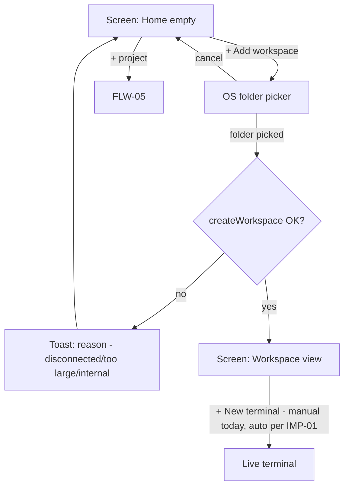
```mermaid
flowchart TD
  A[Screen: Home empty] -->|+ Add workspace| B[OS folder picker]
  A -->|+ project| P[FLW-05]
  B -->|cancel| A
  B -->|folder picked| C{createWorkspace OK?}
  C -->|no| C_err[Toast: reason - disconnected/too large/internal]
  C_err --> A
  C -->|yes| D[Screen: Workspace view]
  D -->|+ New terminal - manual today, auto per IMP-01| E[Live terminal]
```
- **Screens & states:**
  | Screen | States | Key elements |
  |--------|--------|--------------|
  | Home empty | empty | one-sentence guide, + project, + Add workspace |
  | Workspace view | empty, success | tab strip, + New terminal (primary) |
  | Terminal | loading, success, error | PTY pane |

### FLW-02: Capture an idea (⌘K)
- **Traces:** ST-003 (JTBD-04, JRN-01/#5, JRN-05/#1)
- **Goal:** idea saved in one keystroke without losing terminal context
- **Entry points:** global ⌘K from any view (guarded in inputs/terminal/upgrade dialog)
- **Success exit:** toast "idea saved"; idea in project or Inbox
- **Task analysis:** 1. hotkey → 2. type title → 3. (optional) pick project → save. Project defaults to "no project" — orphan path is first-class (FLW-12).
- **Flow:**
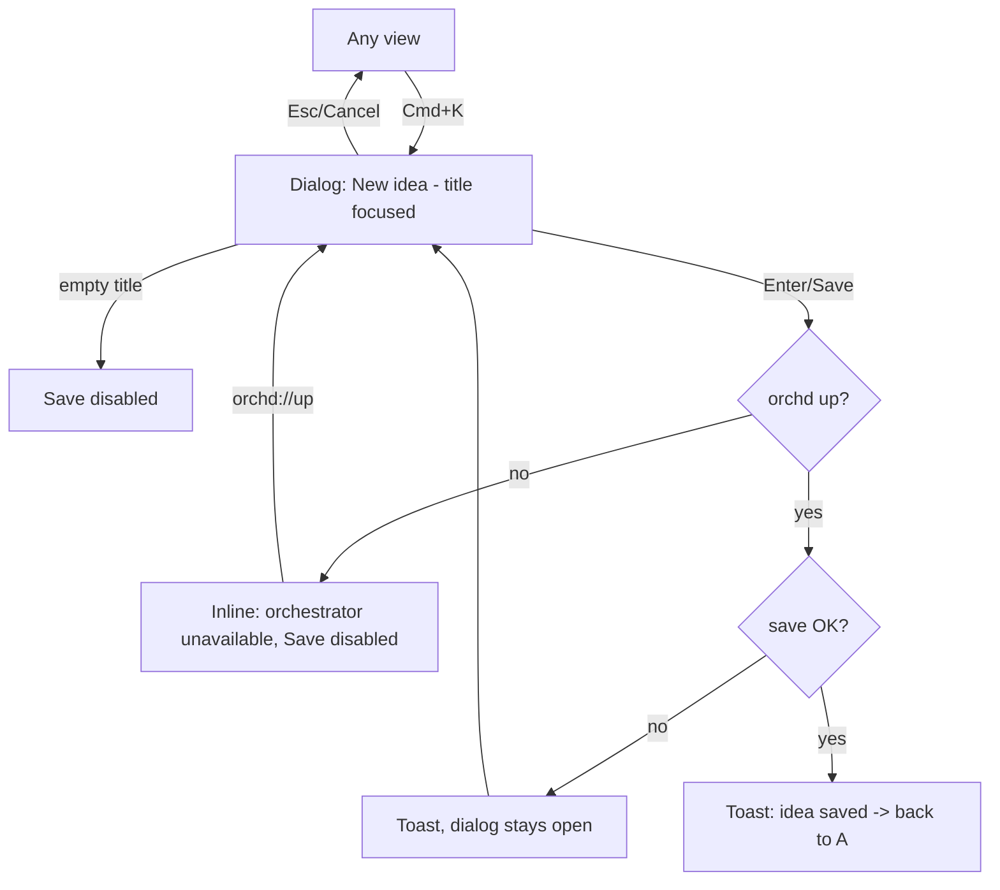
```mermaid
flowchart TD
  A[Any view] -->|Cmd+K| B[Dialog: New idea - title focused]
  B -->|Esc/Cancel| A
  B -->|empty title| B2[Save disabled]
  B -->|Enter/Save| C{orchd up?}
  C -->|no| C_err[Inline: orchestrator unavailable, Save disabled]
  C_err -->|orchd://up| B
  C -->|yes| D{save OK?}
  D -->|no| D_err[Toast, dialog stays open]
  D_err --> B
  D -->|yes| E[Toast: idea saved -> back to A]
```
- **Screens & states:**
  | Screen | States | Key elements |
  |--------|--------|--------------|
  | QuickCapture dialog | error, success | title (primary), description, project select, Save |

### FLW-03: Home triage (v2 attention hub)
- **Traces:** ST-004, ST-005, ST-042 (JTBD-01, JTBD-10, JRN-02, JRN-10/#6)
- **Goal:** act on the top blocker in seconds; absorb what happened while away
- **Entry points:** app launch; sidebar "⌂ Home"; needs-you badge (SCN-048)
- **Success exit:** top escalation answered (or honest "Nothing needs you")
- **Task analysis:** 1. read digest → 2. scan ranked escalations (question visible — no navigation to judge) → 3. Go → answer in terminal → 4. next. Ranking + question preview collapse the old "open every session" loop.
- **Flow:**
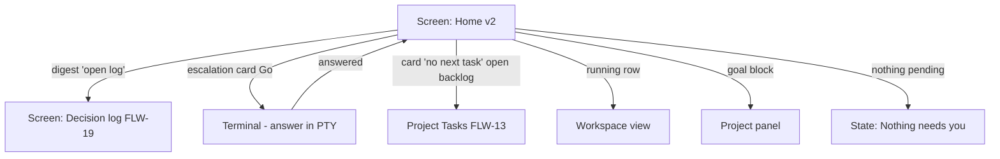
```mermaid
flowchart TD
  A[Screen: Home v2] -->|digest 'open log'| L[Screen: Decision log FLW-19]
  A -->|escalation card Go| T[Terminal - answer in PTY]
  A -->|card 'no next task' open backlog| K[Project Tasks FLW-13]
  A -->|running row| W[Workspace view]
  A -->|goal block| P[Project panel]
  T -->|answered| A
  A -->|nothing pending| Z[State: Nothing needs you]
```
- **Screens & states:**
  | Screen | States | Key elements |
  |--------|--------|--------------|
  | Home v2 | loading, empty, success | digest strip, triage tiles, escalation cards (question + reason + Go, primary), running rows (project·task·elapsed), hand-off rows, goals glance |

### FLW-04: Navigate and link workspaces
- **Traces:** ST-006, ST-007 (JTBD-01, JTBD-06)
- **Goal:** reach any surface in one click; unlinked workspace attached to its project
- **Entry points:** sidebar (always visible)
- **Success exit:** target view active / workspace row moves under its project
- **Flow:**
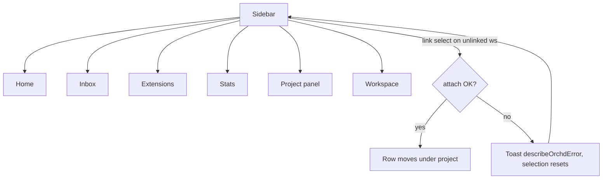
```mermaid
flowchart TD
  S[Sidebar] --> H[Home] & I[Inbox] & X[Extensions] & ST[Stats] & PR[Project panel] & W[Workspace]
  S -->|link select on unlinked ws| L{attach OK?}
  L -->|yes| S2[Row moves under project]
  L -->|no| L_err[Toast describeOrchdError, selection resets]
  L_err --> S
```
- **Screens & states:**
  | Screen | States | Key elements |
  |--------|--------|--------------|
  | Sidebar | empty, success | nav items, project groups, link select, archived toggle, footer |

### FLW-05: Create a project
- **Traces:** ST-008 (JTBD-06, JRN-07/#1)
- **Goal:** named project with ≥1 workspace
- **Entry points:** sidebar "+ project"; Inbox "Create project" (FLW-12 variant)
- **Success exit:** project in sidebar, toast
- **Flow:**
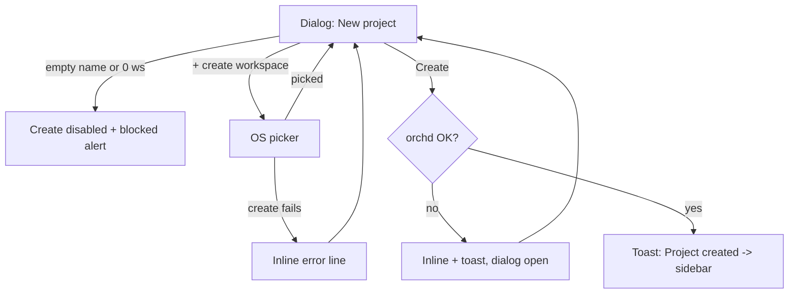
```mermaid
flowchart TD
  A[Dialog: New project] -->|empty name or 0 ws| A2[Create disabled + blocked alert]
  A -->|+ create workspace| B[OS picker] -->|picked| A
  B -->|create fails| B_err[Inline error line] --> A
  A -->|Create| C{orchd OK?}
  C -->|no| C_err[Inline + toast, dialog open] --> A
  C -->|yes| D[Toast: Project created -> sidebar]
```
- **Screens & states:**
  | Screen | States | Key elements |
  |--------|--------|--------------|
  | New project dialog | empty, error, success | Name (primary focus), workspace checkboxes, + create workspace, Create |

### FLW-06: Project lifecycle — export, import, archive
- **Traces:** ST-009 (JTBD-06, JRN-07/#5)
- **Goal:** move work between machines; retire without fear
- **Entry points:** Project panel Overview
- **Success exit:** toast per op; archived project read-only in "Archived (N)"
- **Flow:**
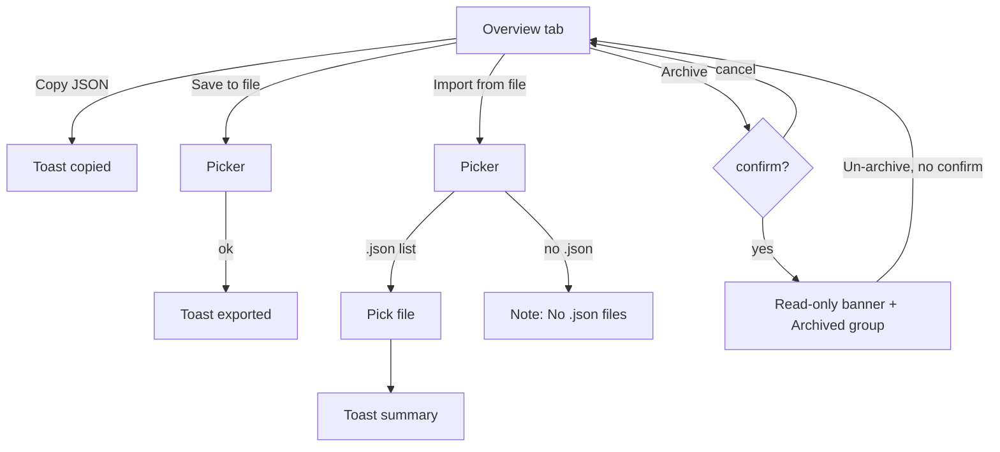
```mermaid
flowchart TD
  O[Overview tab] -->|Copy JSON| T1[Toast copied]
  O -->|Save to file| F1[Picker] -->|ok| T2[Toast exported]
  O -->|Import from file| F2[Picker] -->|.json list| J[Pick file] --> T3[Toast summary]
  F2 -->|no .json| E1[Note: No .json files]
  O -->|Archive| C{confirm?}
  C -->|cancel| O
  C -->|yes| AR[Read-only banner + Archived group]
  AR -->|Un-archive, no confirm| O
```
- **Screens & states:**
  | Screen | States | Key elements |
  |--------|--------|--------------|
  | Overview | loading, error, success | counters, workspaces panel, export/import, Archive (danger, isolated) |

### FLW-07: Terminal session lifecycle
- **Traces:** ST-010, ST-011 (JTBD-02, JRN-03)
- **Goal:** many live agents, none lost, state legible at a glance
- **Entry points:** "+ New terminal"; tab click; Home "Go →"
- **Success exit:** right session focused with full scrollback
- **Flow:**
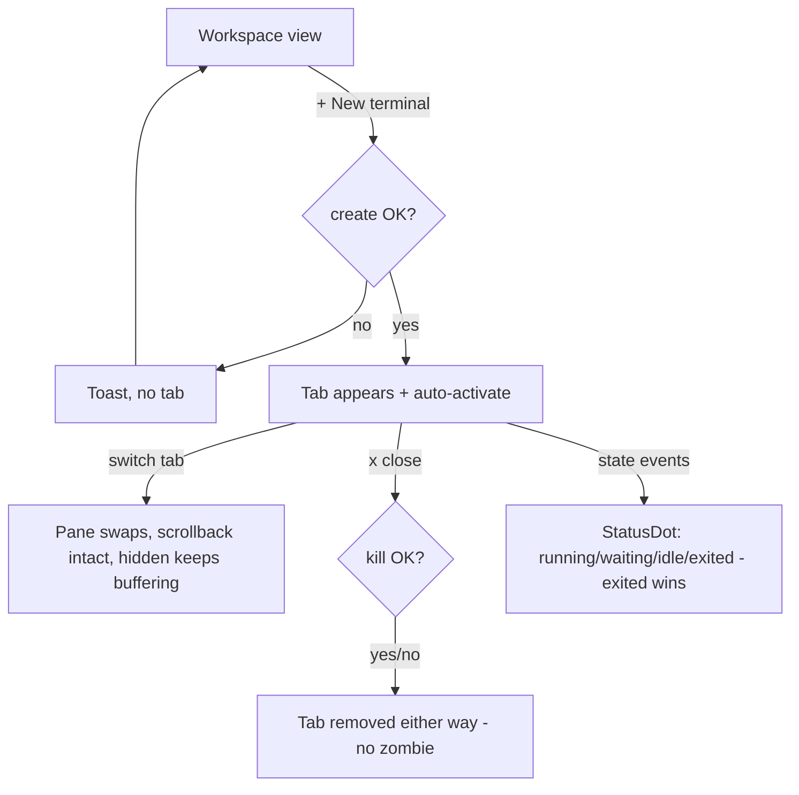
```mermaid
flowchart TD
  W[Workspace view] -->|+ New terminal| C{create OK?}
  C -->|no| C_err[Toast, no tab] --> W
  C -->|yes| T[Tab appears + auto-activate]
  T -->|switch tab| T2[Pane swaps, scrollback intact, hidden keeps buffering]
  T -->|x close| K{kill OK?}
  K -->|yes/no| G[Tab removed either way - no zombie]
  T -->|state events| S[StatusDot: running/waiting/idle/exited - exited wins]
```
- **Screens & states:**
  | Screen | States | Key elements |
  |--------|--------|--------------|
  | Tab strip | empty, success | tabs (dot+title+×), + New terminal (primary) |
  | Terminal pane | loading, error, success | PTY, attach-error overlay (FLW-09) |

### FLW-08: Read the work — command strip and links
- **Traces:** ST-012, ST-013 (JTBD-02, JTBD-03, JRN-03/#3-4)
- **Goal:** outcome of agent commands without scrolling; jump from output to file/URL
- **Entry points:** strip under active terminal; any path/OSC-8 link in output
- **Success exit:** chip read / file preview opened / browser opened
- **Flow:**
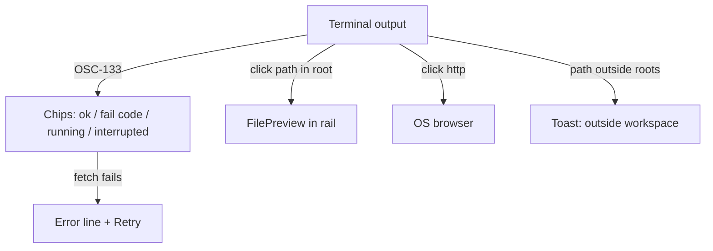
```mermaid
flowchart TD
  T[Terminal output] -->|OSC-133| CS[Chips: ok / fail code / running / interrupted]
  CS -->|fetch fails| CS_err[Error line + Retry]
  T -->|click path in root| PV[FilePreview in rail]
  T -->|click http| BR[OS browser]
  T -->|path outside roots| E[Toast: outside workspace]
```
- **Screens & states:**
  | Screen | States | Key elements |
  |--------|--------|--------------|
  | Command strip | loading, empty, error, success | chips, Retry |

### FLW-09: Survive a restart
- **Traces:** ST-014 (JTBD-02, JTBD-08, JRN-04)
- **Goal:** every session back intact after daemon/app restart — the trust anchor (A-2)
- **Entry points:** daemon://reconnected; app cold boot; attach failure mid-rehydrate
- **Success exit:** tabs restored, visible session replayed without duplication
- **Flow:**
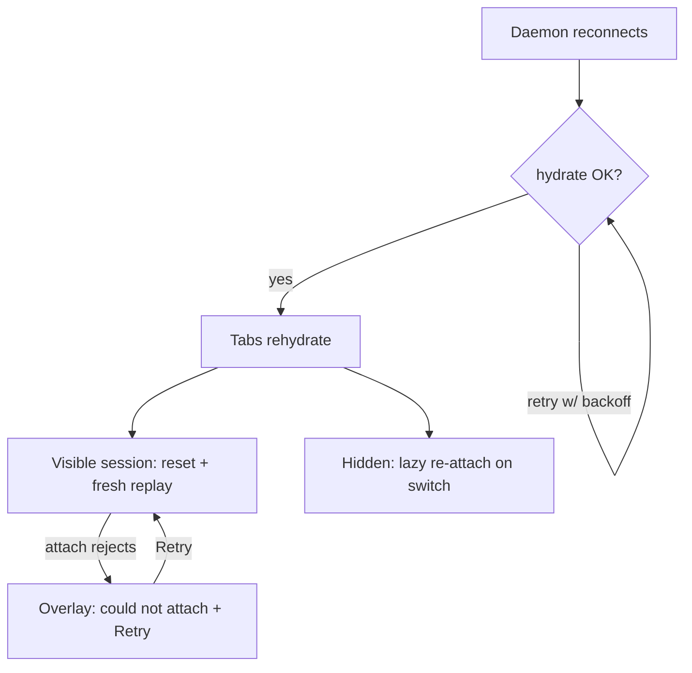
```mermaid
flowchart TD
  R[Daemon reconnects] --> H{hydrate OK?}
  H -->|retry w/ backoff| H
  H -->|yes| T[Tabs rehydrate]
  T --> V[Visible session: reset + fresh replay]
  T --> L[Hidden: lazy re-attach on switch]
  V -->|attach rejects| O[Overlay: could not attach + Retry]
  O -->|Retry| V
```
- **Screens & states:**
  | Screen | States | Key elements |
  |--------|--------|--------------|
  | Terminal pane | loading, error, success | replay, role=alert overlay + Retry |
  | Banner area | error | red DaemonBanner (self-healing) |

### FLW-10: Inspect the workspace
- **Traces:** ST-015, ST-017 (JTBD-03, JRN-06/#1-2, #4)
- **Goal:** verify agent output in place; never trust a stale tree
- **Entry points:** Files rail; terminal link (FLW-08); watch-error event
- **Success exit:** file previewed; tree provably current
- **Flow:**
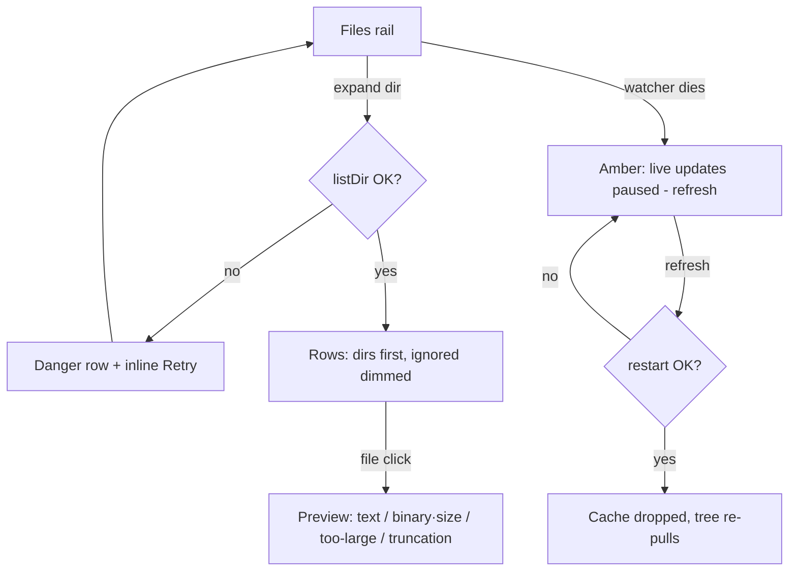
```mermaid
flowchart TD
  F[Files rail] -->|expand dir| D{listDir OK?}
  D -->|no| D_err[Danger row + inline Retry] --> F
  D -->|yes| L[Rows: dirs first, ignored dimmed]
  L -->|file click| P[Preview: text / binary·size / too-large / truncation]
  F -->|watcher dies| W[Amber: live updates paused - refresh]
  W -->|refresh| R{restart OK?}
  R -->|yes| F2[Cache dropped, tree re-pulls]
  R -->|no| W
```
- **Screens & states:**
  | Screen | States | Key elements |
  |--------|--------|--------------|
  | File tree | loading, empty, error, success | rows, show ignored, + Add root, paused banner |
  | Preview | loading, empty, error, success | content, honest fallbacks |

### FLW-11: Manipulate files
- **Traces:** ST-016 (JTBD-03, JRN-06/#3)
- **Goal:** create/rename/delete without leaving the app; delete is reversible (Trash)
- **Entry points:** row context menu / ⋯ button
- **Success exit:** entry changed, parent re-listed
- **Flow:**
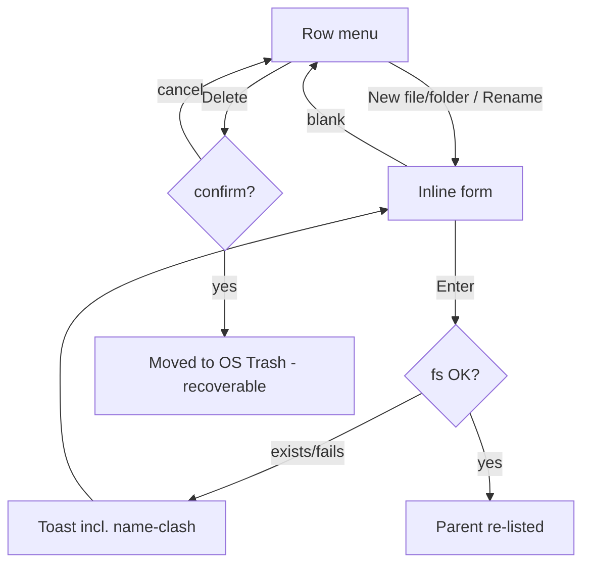
```mermaid
flowchart TD
  M[Row menu] -->|New file/folder / Rename| I[Inline form]
  I -->|blank| M
  I -->|Enter| C{fs OK?}
  C -->|exists/fails| C_err[Toast incl. name-clash] --> I
  C -->|yes| L[Parent re-listed]
  M -->|Delete| D{confirm?}
  D -->|cancel| M
  D -->|yes| TR[Moved to OS Trash - recoverable]
```
- **Screens & states:**
  | Screen | States | Key elements |
  |--------|--------|--------------|
  | Row menu + inline form | error, success | menu items, autofocus input |

### FLW-12: Idea → research → insight → backlog
- **Traces:** ST-018..ST-022 (JTBD-05, JRN-05)
- **Goal:** raw idea becomes a backlog task with reasoning attached, exactly once
- **Entry points:** Ideas tab; Inbox (orphans); ⌘K capture (FLW-02)
- **Success exit:** task in backlog, idea "specced"
- **Task analysis:** capture → (rescue orphan) → research under caps → decide with project context → backlog. Resume guards make every retry idempotent.
- **Flow:**
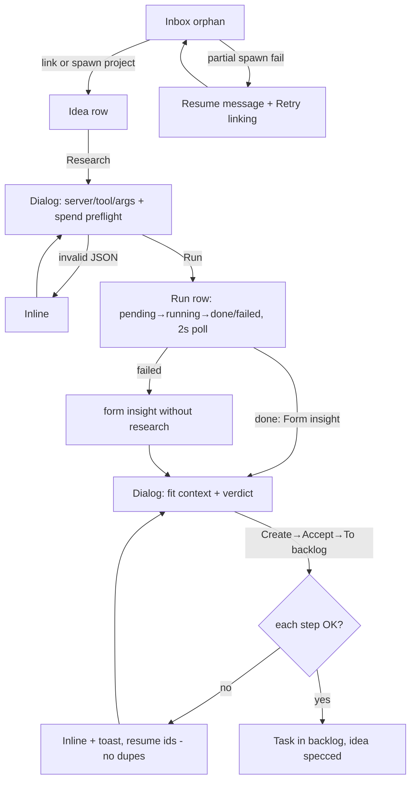
```mermaid
flowchart TD
  I[Idea row] -->|Research| RD[Dialog: server/tool/args + spend preflight]
  RD -->|invalid JSON| RD_err[Inline] --> RD
  RD -->|Run| RUN[Run row: pending→running→done/failed, 2s poll]
  RUN -->|done: Form insight| FI[Dialog: fit context + verdict]
  RUN -->|failed| FI2[form insight without research] --> FI
  FI -->|Create→Accept→To backlog| Q{each step OK?}
  Q -->|no| Q_err[Inline + toast, resume ids - no dupes] --> FI
  Q -->|yes| B[Task in backlog, idea specced]
  ORP[Inbox orphan] -->|link or spawn project| I
  ORP -->|partial spawn fail| ORP_err[Resume message + Retry linking] --> ORP
```
- **Screens & states:**
  | Screen | States | Key elements |
  |--------|--------|--------------|
  | Ideas tab | empty, error, success | create form, rows, lifecycle select |
  | ResearchRunDialog | error, success | preflight, Run (primary) |
  | ResearchPane | loading, empty, error, success | run rows, show artifact |
  | FormInsightDialog | empty, error, success | fit context, 3-stage buttons |
  | Inbox | empty, error, success | orphan rows, link, Create project |

### FLW-13: Plan work — tasks with priority
- **Traces:** ST-023, ST-037 (JTBD-06, JTBD-10, JRN-07/#2, JRN-10/#4)
- **Goal:** work tracked backlog→done; urgent first — and consumed first by the CEO
- **Entry points:** Tasks tab; Home escalation "no next task" (FLW-03)
- **Success exit:** board reflects reality; workflow has an unambiguous next task
- **Flow:**
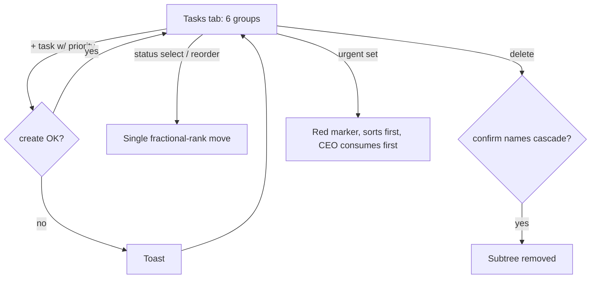
```mermaid
flowchart TD
  T[Tasks tab: 6 groups] -->|+ task w/ priority| A{create OK?}
  A -->|no| A_err[Toast] --> T
  A -->|yes| T
  T -->|status select / reorder| M[Single fractional-rank move]
  T -->|delete| D{confirm names cascade?}
  D -->|yes| R[Subtree removed]
  T -->|urgent set| U[Red marker, sorts first, CEO consumes first]
```
- **Screens & states:**
  | Screen | States | Key elements |
  |--------|--------|--------------|
  | Tasks tab | empty, error, success | create form (+priority), 6 groups w/ counts, urgent markers |

### FLW-14: Steer structure — goals and graph
- **Traces:** ST-024, ST-025 (JTBD-06, JRN-07/#2-3)
- **Goal:** direction explicit (goal tree), knowledge mapped (graph)
- **Entry points:** Goals tab; Graph tab; Home goals glance
- **Success exit:** tree/canvas reflects each mutation
- **Flow:**
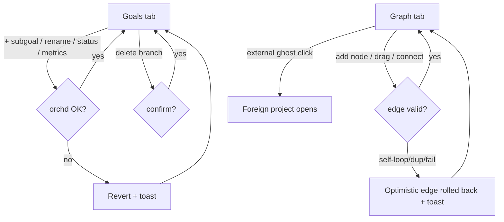
```mermaid
flowchart TD
  G[Goals tab] -->|+ subgoal / rename / status / metrics| GM{orchd OK?}
  GM -->|no| GM_err[Revert + toast] --> G
  GM -->|yes| G
  G -->|delete branch| GD{confirm?} -->|yes| G
  K[Graph tab] -->|add node / drag / connect| KE{edge valid?}
  KE -->|self-loop/dup/fail| KE_err[Optimistic edge rolled back + toast] --> K
  KE -->|yes| K
  K -->|external ghost click| P2[Foreign project opens]
```
- **Screens & states:**
  | Screen | States | Key elements |
  |--------|--------|--------------|
  | Goals tab | empty, error, success | tree rows, strategic root (immovable) |
  | Graph tab | empty, error, success | canvas, add form, search, edge-kind select |

### FLW-15: Govern a project — rules and policy
- **Traces:** ST-029 (JTBD-06, JTBD-07)
- **Goal:** agent behavior bounded by explicit rules, caps, classes, paths
- **Entry points:** Rules tab; external file change/loss events
- **Success exit:** rules+policy persisted; file honestly reconciled
- **Flow:**
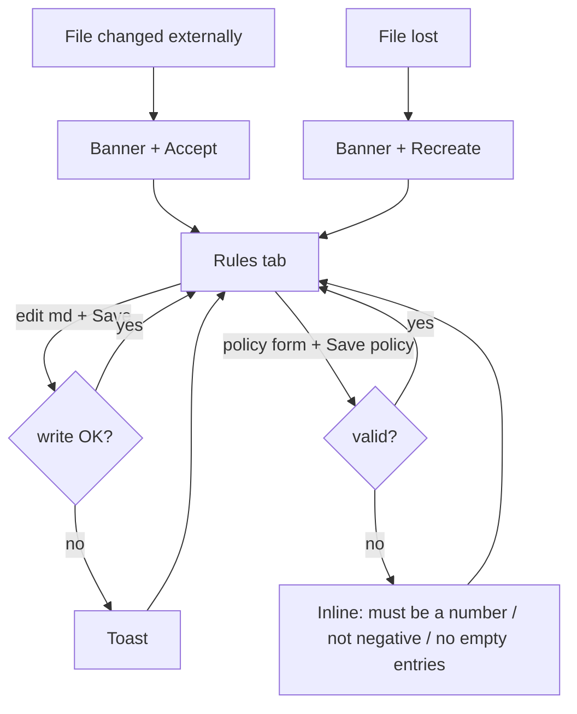
```mermaid
flowchart TD
  R[Rules tab] -->|edit md + Save| S{write OK?}
  S -->|no| S_err[Toast] --> R
  S -->|yes| R
  R -->|policy form + Save policy| V{valid?}
  V -->|no| V_err[Inline: must be a number / not negative / no empty entries] --> R
  V -->|yes| R
  EXT[File changed externally] --> AB[Banner + Accept] --> R
  LOST[File lost] --> RB[Banner + Recreate] --> R
```
- **Screens & states:**
  | Screen | States | Key elements |
  |--------|--------|--------------|
  | Rules tab | loading, error, success | md textarea, policy form, info banners, reveal file |

### FLW-16: Extend with MCP — connect, invoke, govern
- **Traces:** ST-026, ST-027, ST-028 (JTBD-07, JRN-08)
- **Goal:** capability without losing control: consent → invoke labeled → capped + audited
- **Entry points:** Extensions tabs; research server select (FLW-12)
- **Success exit:** tool result read as unverified; spend within caps
- **Flow:**
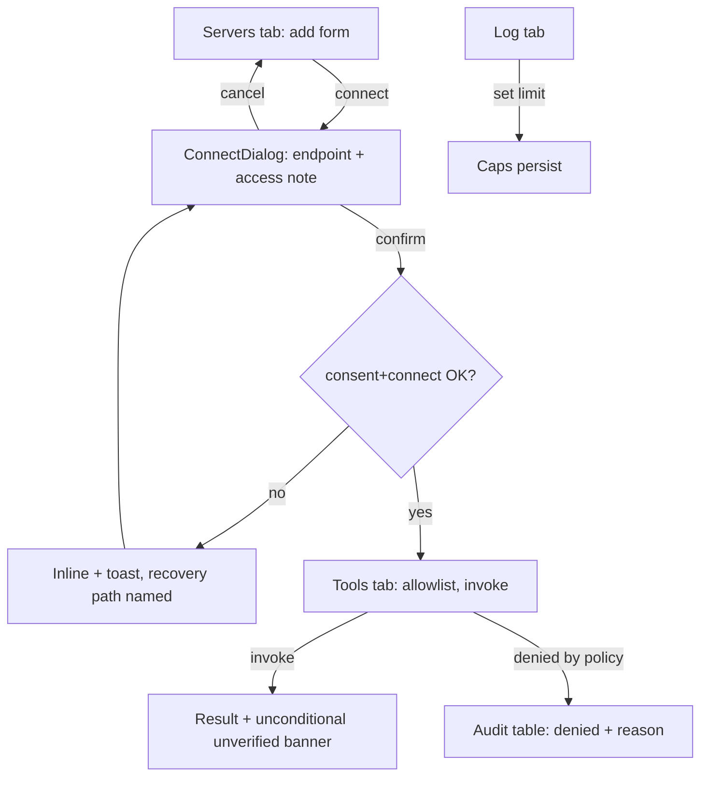
```mermaid
flowchart TD
  S[Servers tab: add form] -->|connect| CD[ConnectDialog: endpoint + access note]
  CD -->|cancel| S
  CD -->|confirm| G{consent+connect OK?}
  G -->|no| G_err[Inline + toast, recovery path named] --> CD
  G -->|yes| T[Tools tab: allowlist, invoke]
  T -->|invoke| R[Result + unconditional unverified banner]
  T -->|denied by policy| AUD[Audit table: denied + reason]
  L[Log tab] -->|set limit| P[Caps persist]
```
- **Screens & states:**
  | Screen | States | Key elements |
  |--------|--------|--------------|
  | Servers/Tools/Connectors/Log/Artifacts/Skills | empty, error, success | consent dialog (primary: Connect), unverified banners, Calls/Audit tables |

### FLW-17: Degrade honestly, recover fully
- **Traces:** ST-030, ST-031, ST-032 (JTBD-08, JRN-09)
- **Goal:** operator always knows true health; recovery paths never dead-end
- **Entry points:** daemon events (disconnect/incompatible/down/storage), render crash, Diagnostics button
- **Success exit:** healthy state restored or honestly labeled degraded
- **Flow:**
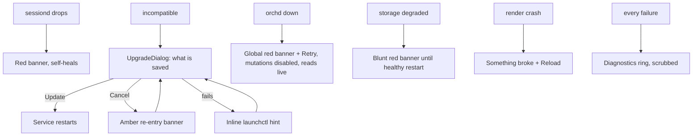
```mermaid
flowchart TD
  E1[sessiond drops] --> B1[Red banner, self-heals]
  E2[incompatible] --> U[UpgradeDialog: what is saved]
  U -->|Update| RESTART[Service restarts]
  U -->|Cancel| AMBER[Amber re-entry banner] --> U
  U -->|fails| U_err[Inline launchctl hint] --> U
  E3[orchd down] --> B3[Global red banner + Retry, mutations disabled, reads live]
  E4[storage degraded] --> B4[Blunt red banner until healthy restart]
  E5[render crash] --> EB[Something broke + Reload]
  ALL[every failure] --> DIAG[Diagnostics ring, scrubbed]
```
- **Screens & states:**
  | Screen | States | Key elements |
  |--------|--------|--------------|
  | Banners | error, success | four banner kinds, actions |
  | ErrorBoundary | error | Reload (primary), Copy details |
  | Diagnostics | empty, success | ring, copy bundle, clear |

### FLW-18: Keep the machine awake *(to-be)*
- **Traces:** ST-033 (JTBD-10, JRN-10/#5)
- **Goal:** long unattended runs never killed by sleep; state never lies
- **Entry points:** toggle in sidebar footer (default on); session count changes
- **Success exit:** assertion held while ≥1 live session; released after
- **Flow:**
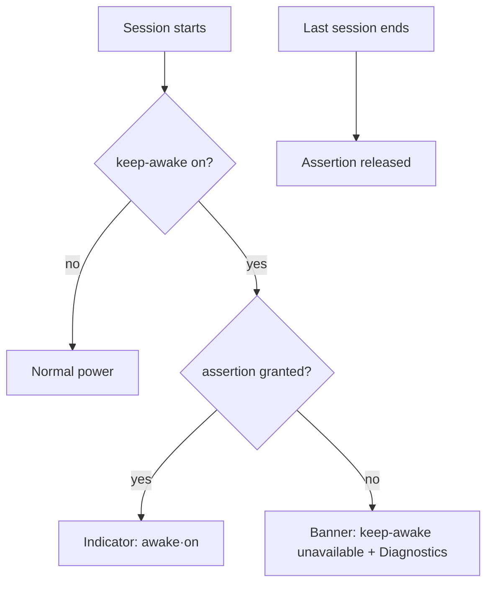
```mermaid
flowchart TD
  S[Session starts] --> A{keep-awake on?}
  A -->|no| N[Normal power]
  A -->|yes| H{assertion granted?}
  H -->|yes| I[Indicator: awake·on]
  H -->|no| H_err[Banner: keep-awake unavailable + Diagnostics]
  L[Last session ends] --> REL[Assertion released]
```
- **Screens & states:**
  | Screen | States | Key elements |
  |--------|--------|--------------|
  | Sidebar footer | success, error | toggle, ok-dot indicator, failure surfacing |

### FLW-19: CEO supervision loop *(to-be — the autonomy core)*
- **Traces:** ST-034, ST-035, ST-036 (JTBD-10, JRN-10)
- **Goal:** questions answered and work continued within delegated authority; everything logged; out-of-scope always escalates
- **Entry points:** Rules → supervisor setup; agent question event; task-completion event; Home digest "open log"
- **Success exit:** session running again (answered / next task) or honestly parked "needs you"
- **Task analysis:** delegate once (scope+instruction) → system runs the loop → operator only sees escalations and the log. First-value = first autonomous answer that saves an interruption.
- **Flow:**
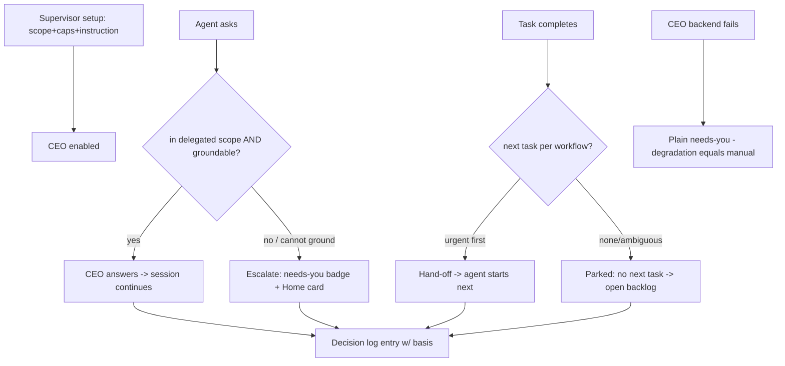
```mermaid
flowchart TD
  SET[Supervisor setup: scope+caps+instruction] --> ON[CEO enabled]
  Q[Agent asks] --> CL{in delegated scope AND groundable?}
  CL -->|yes| ANS[CEO answers -> session continues]
  CL -->|no / cannot ground| ESC[Escalate: needs-you badge + Home card]
  ANS --> LOG[Decision log entry w/ basis]
  ESC --> LOG
  DONE[Task completes] --> NX{next task per workflow?}
  NX -->|urgent first| HAND[Hand-off -> agent starts next] --> LOG
  NX -->|none/ambiguous| PARK[Parked: no next task -> open backlog] --> LOG
  CEOFAIL[CEO backend fails] --> DEGR[Plain needs-you - degradation equals manual]
```
- **Screens & states:**
  | Screen | States | Key elements |
  |--------|--------|--------------|
  | Supervisor setup | error, success | enable toggle, class chips, instruction, scope summary (primary: Save policy) |
  | Decision log | empty, success | digest, entries w/ basis, escalation links |
  | Session surfaces | success | "CEO answered" marker, escalated tab tint |

### FLW-20: Read the operation *(to-be)*
- **Traces:** ST-038, ST-039, ST-040 (JTBD-11, JRN-11)
- **Goal:** "where did the week go" in under a minute
- **Entry points:** sidebar "✦ Stats"; Home spend tile
- **Success exit:** outlier spotted → action taken (caps/kill/rebalance)
- **Flow:**
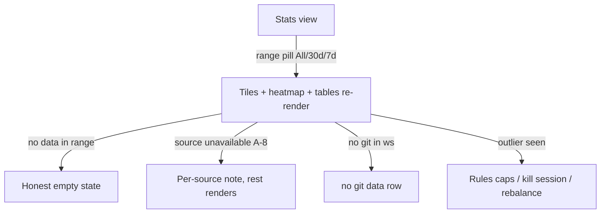
```mermaid
flowchart TD
  S[Stats view] -->|range pill All/30d/7d| R[Tiles + heatmap + tables re-render]
  R -->|no data in range| E[Honest empty state]
  R -->|source unavailable A-8| P[Per-source note, rest renders]
  R -->|no git in ws| G[no git data row]
  R -->|outlier seen| ACT[Rules caps / kill session / rebalance]
```
- **Screens & states:**
  | Screen | States | Key elements |
  |--------|--------|--------------|
  | Stats view | loading, empty, error, success | SegmentedPill, stat tiles, Heatmap, per-project table, freshness stamp |

### FLW-21: Project documentation *(to-be)*
- **Traces:** ST-041 (JTBD-06, JRN-07/#2)
- **Goal:** docs live with the project; agents read the same files
- **Entry points:** Docs tab; external file edits (agents/editors)
- **Success exit:** doc saved and rendered; external changes reconciled
- **Flow:**
```mermaid
flowchart TD
  D[Docs tab: list] -->|+ doc| N[Name -> editor]
  D -->|open doc| ED[Editor / preview toggle]
  ED -->|Save| S{write OK?}
  S -->|no| S_err[Inline + toast, content preserved] --> ED
  S -->|yes| ED
  EXT[Changed externally] --> AB[Accept banner] --> ED
  LOST[File lost] --> RB[Recreate banner] --> D
  ED -->|Delete + confirm| D
```
- **Screens & states:**
  | Screen | States | Key elements |
  |--------|--------|--------------|
  | Docs tab | loading, empty, error, success | list, editor, edit/preview toggle (primary: Save), banners |

---

## Improvement findings (PRN pass 2026-07-23)

Walked all 21 flows against PRN-01..16 + journey pains. Applied = fixed in
this change (scenarios and/or Figma); Deferred = traced proposals for the
wave plan. No untraced changes.

### Applied

**IMP-01 [PRN-16, PRN-12 / BP-041] FLW-01 — first value is one click too late** · severity 3 (major)
- Every first-run reaches JRN-01's aha (live terminal) only via a manual "+ New terminal" after the folder pick. Task analysis: the step serves no decision — the system knows the user wants a terminal (it's the product's core).
- **Fix:** auto-spawn the first terminal when a workspace is created from the empty state → **SCN-056 (draft)**. Effect: time-to-aha drops by one step; JTBD-09 metric (<2 min) protected.
- Before → after:
```mermaid
flowchart LR
  B[folder picked] --> D[Workspace view] -->|manual +New terminal| E[Terminal]
```
```mermaid
flowchart LR
  B[folder picked] --> D[Workspace view w/ terminal auto-spawned] --> E[Terminal live]
```

**IMP-02 [PRN-09, flow rule: recovery lands somewhere useful] FLW-03/FLW-19 — "no next task" escalation recovers into the wrong surface** · severity 3 (major)
- The parked-session card's only action was "Go →" (terminal). But the recovery for "no next task" is *adding/prioritizing a task* — the terminal is a dead end for that job.
- **Fix:** "no next task" cards carry **"open backlog →"** routing to the project's Tasks tab (SCN-055 updated; Figma Home v2 card updated). Effect: recovery in one click instead of terminal → manual navigation.
- Before → after:
```mermaid
flowchart LR
  C[Card: no next task] -->|Go| T[Terminal - nothing to do there]
```
```mermaid
flowchart LR
  C[Card: no next task] -->|open backlog| K[Tasks tab - add/prioritize] -->|CEO resumes| RUN[Session continues]
```

**IMP-03 [PRN-12 / BP-012] FLW-19 — delegation setup is decision-heavy with no default** · severity 2 (minor)
- SCN-046 asks the operator to hand-pick classes/caps from scratch — decision fatigue at the trust-critical moment.
- **Fix:** "Recommended scope" preset button (safe-shell + file-write, policy caps inherited) added to SCN-046 + Figma supervisor setup. Effect: safe one-click start, scope still editable.

### Deferred (traced proposals → wave plan)

| # | PRN/BP | Flow | Finding | Proposal | Sev | F×S×S note |
|---|--------|------|---------|----------|-----|------------|
| IMP-04 | PRN-03 | FLW-13/14/12 | Record deletes (task/idea/insight/goal branch/graph selection) are confirm-only — no undo; files got Trash, records got nothing | Post-delete undo toast (5s) for record deletions; undo beats confirmation | 3 | frequent ops; medium effort (orchd soft-delete) |
| IMP-05 | PRN-01/16 | FLW-09 | Successful rehydrate is silent — the trust-anchor moment (A-2) gives no positive signal | One-shot toast "n/n sessions restored" after full rehydrate | 2 | rare event, trivial effort, big trust payoff |
| IMP-06 | PRN-07 | FLW-03 | No keyboard path to the top escalation — frequent operator action is mouse-only | Global hotkey (e.g. ⌘J) → jump to top needs-you session | 2 | frequent once CEO ships; small effort |
| IMP-07 | PRN-13 | FLW-05..15 | Project panel reaches 8 tabs — at Hick threshold | Group tabs visually (Work: Goals/Ideas/Tasks/Insights · Knowledge: Graph/Docs · Control: Rules) — labels only, no structure change | 1 | cosmetic; revisit at 9th tab |
| IMP-08 | PRN-01 | FLW-20 | Stats freshness only on output section | "as of" stamp on every stats panel | 1 | trivial, fold into SCN-052 build |

---

## Definition of done

- 21 flows, each traced to stories; every screen node states-declared; every
  error edge lands on recovery (verified per-diagram); entry points enumerated.
- Scenario cross-links: every scenario Traces now carries its FLW id; every
  flow lists ≥1 covering scenario via the map in this file's flow Traces.
- PRN pass complete: 3 findings applied in-change, 5 deferred with traces —
  nothing silent.
